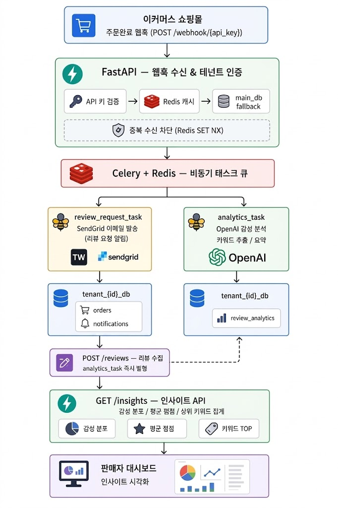
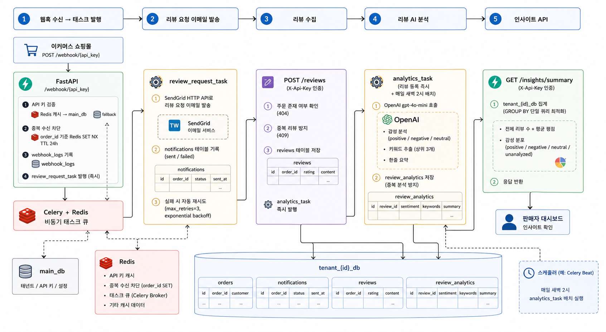

# ezyreview

> 이커머스 쇼핑몰의 주문 완료 웹훅을 수신해 리뷰 요청 알림을 자동 발송하고, AI로 수집된 리뷰를 분석하는 **멀티테넌트 SaaS 백엔드**


**API 문서 (라이브):** https://ezyreview-production.up.railway.app/docs

---

## 만들게 된 계기

실무에서 멀티테넌트 구조와 Celery 기반 비동기 처리를 직접 다뤄본 경험이 있습니다.

그 경험을 바탕으로, 요즘 빠르게 실용화되고 있는 **LLM 연동**까지 직접 설계하고 구현해보고 싶었습니다. 단순한 CRUD가 아닌 — 멀티테넌시, 비동기 파이프라인, AI 분석을 하나의 서비스로 연결하는 구조를 스스로 만들어보는 것이 목표였습니다.

도메인으로 이커머스 리뷰를 선택한 건, 리뷰 수집·분석 자동화가 실제 서비스로 존재하고 비즈니스 가치가 명확한 문제이기 때문입니다.

---

## 시스템 아키텍처


<!-- ```
[이커머스 쇼핑몰]
      │ 주문완료 웹훅 (POST /webhook/{api_key})
      ▼
[FastAPI — 웹훅 수신 & 테넌트 인증]
      │ API 키 검증 → Redis 캐시 → main_db fallback
      │ 중복 수신 차단 (Redis SET NX)
      ▼
[Celery + Redis — 비동기 태스크 큐]
      │
      ├──────────────────────────────┐
      ▼                              ▼
[review_request_task]         [analytics_task]
 SendGrid 이메일 발송           OpenAI 감성 분석
 (리뷰 요청 알림)               키워드 추출 / 요약
      │                              │
      ▼                              ▼
[tenant_{id}_db]              [tenant_{id}_db]
 orders / notifications         review_analytics
      │
      ▼
[POST /reviews — 리뷰 수집]
      │ analytics_task 즉시 발행
      ▼
[GET /insights — 인사이트 API]
 감성 분포 / 평균 평점 집계
``` -->

**설계 원칙**
- 웹훅 수신과 비즈니스 로직 분리 — Celery로 위임해 API 응답 200ms 이하 유지
- 테넌트별 완전 격리 DB — 구조적으로 데이터 혼용 불가
- AI 분석 비동기 처리 — 리뷰 요청 발송 지연 없음

---

## 기술 스택

| 계층 | 기술 | 선택 이유 |
|------|------|-----------|
| API 서버 | FastAPI | 비동기 처리, 타입 안정성, Pydantic 스키마 검증 |
| 태스크 큐 | Celery + Redis | 웹훅 수신과 처리 분리, 재시도 전략 내장 |
| DB | PostgreSQL | 멀티테넌트 DB 분리 운영, 트랜잭션 신뢰성 |
| ORM | SQLAlchemy 2.0 (async) | 동적 DB 라우팅 구현 |
| AI 분석 | OpenAI gpt-4o-mini | 감성 분석, 키워드 추출, 한줄 요약 |
| 이메일 알림 | SendGrid | 클라우드 환경 SMTP 포트 차단 우회 (HTTP API) |
| 인프라 | Docker Compose + Railway | 로컬 개발 일관성, 클라우드 배포 |

---

## 멀티테넌시 전략

```
main_db
├── tenants          (테넌트 정보, API 키, 플랜)
└── webhook_logs     (수신 이력, 디버깅용)

tenant_{id}_db       (테넌트별 완전 격리)
├── orders           (주문 정보)
├── reviews          (수집된 리뷰)
├── notifications    (발송 이력)
└── review_analytics (AI 분석 결과)
```

**왜 DB 분리형을 선택했나**

| 전략 | 장점 | 단점 |
|------|------|------|
| DB 분리 (채택) | 완전한 데이터 격리, 테넌트별 백업/이전 용이 | DB 커넥션 수 증가 |
| 스키마 분리 | 커넥션 공유 가능 | PostgreSQL 스키마 관리 복잡 |
| Row-level | 단순한 구조 | 쿼리마다 tenant_id 필터 필수, 실수 시 전체 노출 위험 |

대형 유통사 포함 멀티테넌트 환경을 DB 분리형으로 운영한 경험을 바탕으로 선택했습니다.

---

## 전체 데이터 흐름



### 1. 웹훅 수신 → 태스크 발행

```
POST /webhook/{api_key}
  │
  ├── API 키 검증 (Redis 캐시 → main_db fallback)
  ├── 중복 수신 차단 (order_id 기준 Redis SET NX TTL 24h)
  ├── webhook_logs 기록
  └── review_request_task 발행 (즉시)
```

### 2. 리뷰 요청 이메일 발송

```
review_request_task
  │
  ├── SendGrid HTTP API로 리뷰 요청 이메일 발송
  ├── notifications 테이블 기록 (sent / failed)
  └── 실패 시 자동 재시도 (max_retries=3, exponential backoff)
```

### 3. 리뷰 수집

```
POST /reviews  (Authorization: Bearer {jwt})
  │
  ├── JWT 서명 검증 + 테넌트 식별 (DB 조회 없음, 페이로드에서 추출)
  ├── 주문 존재 여부 확인 (404)
  ├── 중복 리뷰 방지 (409)
  ├── reviews 테이블 저장
  └── analytics_task 즉시 발행
```

### 4. 리뷰 AI 분석

```
analytics_task (리뷰 등록 즉시 + 매일 새벽 2시 배치)
  │
  ├── OpenAI gpt-4o-mini 호출
  │     ├── 감성 분석 (positive / negative / neutral)
  │     ├── 키워드 추출 (상위 3개)
  │     └── 한줄 요약
  └── review_analytics 저장 (중복 분석 방지)
```

### 5. 인사이트 API

```
GET /insights/summary  (Authorization: Bearer {jwt})
  │
  ├── JWT 서명 검증 + 테넌트 식별
  ├── tenant_{id}_db 집계 (GROUP BY 단일 쿼리 최적화)
  │     ├── 전체 리뷰 수 + 평균 평점
  │     └── 감성 분포 (positive / negative / neutral / unanalyzed)
  └── 응답 반환
```

---

## 주요 설계 포인트

**1. 웹훅 중복 수신 방지**

쇼핑몰 플랫폼은 네트워크 이슈 시 웹훅을 재전송합니다. `order_id` 기준으로 Redis `SET NX TTL`을 적용해 동일 주문의 중복 처리를 차단합니다.

**2. 테넌트 DB 동적 라우팅**

API 키 → 테넌트 ID 추출 → 해당 테넌트 DB 커넥션 반환. SQLAlchemy 엔진을 요청 시점에 동적으로 생성하며, 테넌트 엔진은 메모리에 캐싱해 반복 생성 비용을 제거합니다. 코드 변경 없이 테넌트 수를 수평 확장할 수 있습니다.

**3. Celery 태스크 재시도 전략**

외부 API(SendGrid, OpenAI) 장애를 고려해 `autoretry_for`, `max_retries=3`, 지수 백오프를 적용합니다. 최종 실패 시 `notifications` 테이블에 실패 상태를 기록해 수동 재발송이 가능합니다.

**4. AI 분석 비용 최적화**

리뷰 등록 즉시 분석 태스크를 발행하되, 분석 완료 여부를 사전 확인해 중복 호출을 방지합니다. Celery beat로 미분석 리뷰를 일 배치 처리해 누락 없이 커버합니다.

---

## 성능 측정 결과

Locust 부하 테스트 — 동시 50 users, 60초, 로컬 Docker Desktop (Windows)

| 엔드포인트 | Median | p95 | p99 | 에러율 |
|---|---|---|---|---|
| 웹훅 수신 (신규) | 92ms | 1,000ms | 1,200ms | **0%** |
| 웹훅 수신 (중복 차단) | 56ms | 360ms | 500ms | **0%** |
| 인사이트 API | 41ms | 880ms | 1,000ms | **0%** |
| **전체 집계** | **71ms** | **920ms** | **1,100ms** | **0%** |

- 처리량: **86.9 req/s** (5,075 requests / 60초)
- p99가 높은 것은 Docker Desktop WSL2 네트워킹 오버헤드 영향
- `GET /insights/summary`: DB 쿼리 5회 → GROUP BY 단일 쿼리로 최적화, median 170ms → 41ms

**배치 AI 분석**: 리뷰 100건 기준 약 90초 이내 완료 (gpt-4o-mini 기준)

---

## 테스트

```bash
# Docker 컨테이너 안에서 실행
docker exec ezyreview-api-1 python -m pytest tests/ -v --ignore=tests/load_test.py
```

**17개 케이스 전체 통과**

| 파일 | 테스트 케이스 |
|---|---|
| `test_webhook.py` | 정상 수신, 중복 차단, 잘못된 API 키 |
| `test_auth.py` | JWT 발급, 잘못된 키 → 401, 필드 누락 → 422 |
| `test_reviews.py` | 등록, 주문 없음 → 404, 중복 → 409, 평점 초과 → 422, 인증 없음 → 401 |
| `test_insights.py` | summary, 인증 없음, 목록, sentiment 필터, 잘못된 필터 → 422, 페이지네이션 |

외부 의존성(Redis, Celery, SendGrid)은 모두 mock 처리해 빠르고 독립적으로 실행됩니다.

---

## 로컬 실행

```bash
git clone https://github.com/devleeeasy/ezyreview
cd ezyreview
cp .env.example .env   # OPENAI_API_KEY, SENDGRID_API_KEY 등 입력
docker compose up -d   # api / worker / beat / db / redis 일괄 기동
```

```bash
# 1. 테넌트 등록 → API 키 발급
curl -X POST http://localhost:8000/tenants \
  -H "Content-Type: application/json" \
  -d '{"name": "내 쇼핑몰", "plan": "basic"}'

# 2. API 키 → JWT 토큰 발급 (관리 API 인증용)
curl -X POST http://localhost:8000/auth/token \
  -H "Content-Type: application/json" \
  -d '{"api_key": "{api_key}"}'

# 3. 웹훅 수신 테스트 (API 키 — 서버→서버 통신)
curl -X POST http://localhost:8000/webhook/{api_key} \
  -H "Content-Type: application/json" \
  -d '{"order_id": "ORD-001", "customer_phone": "test@example.com", "product_name": "테스트 상품"}'

# 4. 리뷰 등록 (JWT Bearer — 관리 API)
curl -X POST http://localhost:8000/reviews \
  -H "Content-Type: application/json" \
  -H "Authorization: Bearer {access_token}" \
  -d '{"order_id": "ORD-001", "content": "배송 빠르고 품질 좋아요!", "rating": 5.0}'

# 5. 인사이트 조회 (JWT Bearer — 관리 API)
curl http://localhost:8000/insights/summary \
  -H "Authorization: Bearer {access_token}"
```

API 문서 (로컬): `http://localhost:8000/docs`  
API 문서 (라이브): `https://ezyreview-production.up.railway.app/docs`

---

## 디렉토리 구조

```
ezyreview/
├── app/
│   ├── api/
│   │   ├── webhook.py       # 웹훅 수신 엔드포인트
│   │   ├── reviews.py       # 리뷰 수집 엔드포인트
│   │   ├── insights.py      # 인사이트 API
│   │   ├── auth.py          # JWT 발급 엔드포인트
│   │   ├── tenants.py       # 테넌트 등록
│   │   └── admin.py         # 배치 분석 수동 트리거 (운영용)
│   ├── core/
│   │   ├── db.py            # 테넌트 DB 동적 라우팅 핵심
│   │   ├── auth.py          # API 키(웹훅) / JWT Bearer(관리 API) 인증
│   │   └── config.py        # 환경변수 설정
│   ├── models/
│   │   ├── main.py          # main_db 모델 (Tenant, WebhookLog)
│   │   └── tenant.py        # tenant_db 모델 (Order, Review, Notification, ReviewAnalytics)
│   └── schemas/             # 요청/응답 스키마 (Pydantic v2)
├── worker/
│   ├── celery_app.py        # Celery 설정 + beat 스케줄
│   ├── tasks.py             # Celery 태스크 정의
│   ├── review_request.py    # SendGrid 이메일 발송
│   └── analytics.py        # OpenAI AI 분석
├── tests/
│   ├── conftest.py          # 픽스처 (NullPool DB, Redis mock, 이메일 제한)
│   ├── test_webhook.py
│   ├── test_reviews.py
│   ├── test_auth.py
│   ├── test_insights.py
│   └── load_test.py         # Locust 부하 테스트
├── scripts/
│   └── seed_reviews.py      # 테스트 데이터 삽입
├── docker-compose.yml
└── .env.example
```

---

## 환경 변수

| 변수 | 설명 |
|------|------|
| `DATABASE_URL` | main_db PostgreSQL URL (asyncpg 드라이버) |
| `REDIS_URL` | Redis URL (Celery 브로커 + API 키 캐시) |
| `OPENAI_API_KEY` | OpenAI API 키 (미설정 시 dev 모드 더미 반환) |
| `SENDGRID_API_KEY` | SendGrid API 키 (이메일 발송) |
| `SENDGRID_FROM_EMAIL` | SendGrid 발신자 인증 이메일 |
| `GMAIL_USER` | Gmail 발신 주소 (로컬 전용 — 클라우드 SMTP 포트 차단) |
| `GMAIL_APP_PASSWORD` | Gmail 앱 비밀번호 (로컬 전용) |
| `JWT_SECRET` | JWT 서명 키 (프로덕션에서 반드시 변경) |

---

## 부하 테스트

```bash
pip install locust
locust -f tests/load_test.py --host http://localhost:8000
# http://localhost:8089 에서 Locust UI 접속
```

---

## 트러블슈팅 기록

실제 개발·배포 과정에서 마주친 이슈와 해결 방법입니다.

**1. Celery + asyncio 이벤트 루프 충돌**

Celery 워커는 태스크마다 `asyncio.run()`으로 새 이벤트 루프를 생성합니다. 모듈 수준에서 캐시된 SQLAlchemy 엔진(asyncpg)과 `AsyncOpenAI` 클라이언트가 이전 루프에 바인딩된 상태로 재사용되어 `InterfaceError: another operation is in progress` 에러가 발생했습니다.

→ **해결**: `NullPool` 적용으로 태스크마다 새 DB 커넥션 생성, `AsyncOpenAI` 클라이언트도 호출 시점에 생성하도록 변경

**2. Railway SMTP 포트 차단**

Railway를 포함한 대부분의 클라우드 플랫폼은 스팸 방지 목적으로 아웃바운드 SMTP 포트(465, 587)를 차단합니다. Gmail SMTP는 로컬에서 정상 동작하지만, Railway 배포 환경에서는 `Network is unreachable` 에러가 발생합니다.

→ **해결**: SendGrid HTTP API로 전환 (SMTP 대신 HTTPS 사용)  
→ **추가 이슈**: 무료 계정 + 단일 발신자 인증만으로는 스팸 분류될 수 있음. 실서비스에서는 SPF/DKIM 도메인 인증 필요

**3. Railway `$PORT` 환경변수 미확장**

Railway는 `startCommand`를 exec form으로 실행하므로 `$PORT`가 리터럴 문자열로 전달됩니다. `${PORT:-8000}` 형식도 확장되지 않아 uvicorn이 포트 파싱에 실패했습니다.

→ **해결**: Dockerfile CMD를 shell form으로 변경 (`CMD uvicorn ... --port ${PORT:-8000}`)
