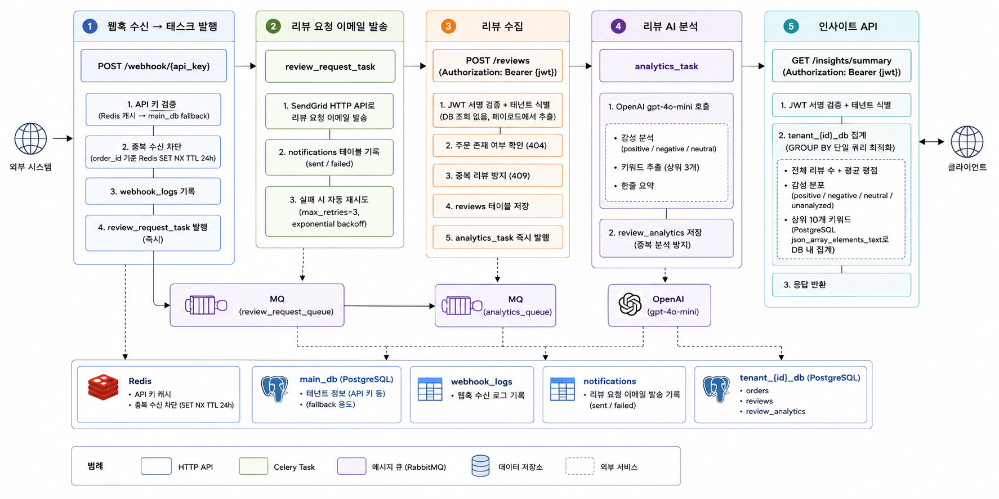
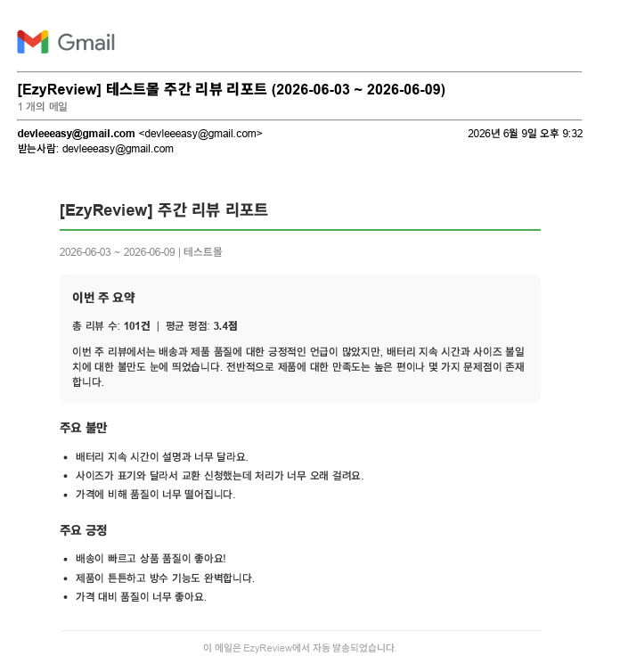

# 전체 데이터 흐름

[← README로 돌아가기](../README.md)

웹훅 수신부터 AI 분석, 시맨틱 검색, 주간 리포트까지 전체 파이프라인의 단계별 상세 동작입니다.



### 1. 웹훅 수신 → 태스크 발행

```
POST /webhook/{api_key}
  │
  ├── API 키 검증 (Redis 캐시 → main_db fallback)
  ├── 중복 수신 차단 (order_id 기준 Redis SET NX TTL 24h)
  ├── webhook_logs 기록
  └── review_request_task 발행 (즉시)
```

### 2. 리뷰 요청 이메일 발송

```
review_request_task
  │
  ├── SendGrid HTTP API로 리뷰 요청 이메일 발송
  ├── notifications 테이블 기록 (sent / failed)
  └── 실패 시 자동 재시도 (max_retries=3, exponential backoff)
```

### 3. 리뷰 수집

```
POST /reviews  (Authorization: Bearer {jwt})
  │
  ├── JWT 서명 검증 + 테넌트 식별 (DB 조회 없음, 페이로드에서 추출)
  ├── 주문 존재 여부 확인 (404)
  ├── 중복 리뷰 방지 (409)
  ├── reviews 테이블 저장
  ├── analytics_task 즉시 발행
  └── generate_embedding_task 즉시 발행
```

### 4. 리뷰 AI 분석

```
analytics_task (리뷰 등록 즉시 + 매일 새벽 2시 배치)
  │
  ├── OpenAI gpt-4o-mini 호출
  │     ├── 감성 분석 (positive / negative / neutral)
  │     ├── 키워드 추출 (상위 3개)
  │     └── 한줄 요약
  └── review_analytics 저장 (중복 분석 방지)
```

### 5. 인사이트 API

```
GET /insights/summary  (Authorization: Bearer {jwt})
  │
  ├── JWT 서명 검증 + 테넌트 식별
  ├── tenant_{id}_db 집계 (3개 쿼리, GROUP BY 최적화)
  │     ├── 전체 리뷰 수 + 평균 평점 (단일 쿼리)
  │     ├── 감성 분포 (positive / negative / neutral / unanalyzed — GROUP BY 단일 쿼리)
  │     └── 상위 3개 키워드 (PostgreSQL json_array_elements_text로 DB 내 집계)
  └── 응답 반환
```

### 6. 리뷰 임베딩 생성

```
generate_embedding_task (리뷰 등록 즉시)
  │
  ├── OpenAI text-embedding-3-small 호출 (1536차원 벡터)
  └── reviews.embedding 컬럼 업데이트
```

### 7. 의미 기반 리뷰 검색

```
GET /insights/search?q=배송이 느려요
  │
  ├── 검색어 → text-embedding-3-small 임베딩
  ├── pgvector 코사인 유사도 검색 (reviews.embedding <=> query_vector)
  ├── sentiment / 평점 범위 필터 선택 적용
  └── 유사도 높은 리뷰 최대 50건 반환
```

### 8. 주간 리포트 생성 및 발송

```
Celery Beat (매주 월요일 오전 9시 KST)
  │
  ├── 전체 active 테넌트 조회
  └── generate_weekly_report_task.group() 병렬 실행
        │
        ├── 7일치 reviews + review_analytics 집계
        │     (total_reviews, avg_rating, 감성 레이블 포함 본문 최대 50건)
        ├── OpenAI gpt-4o-mini로 요약 / 주요 불만 / 주요 긍정 추출
        ├── weekly_reports 저장
        └── send_weekly_report_email_task 체이닝
              ├── SendGrid HTML 이메일 발송
              └── mail_sent_at 업데이트
```


